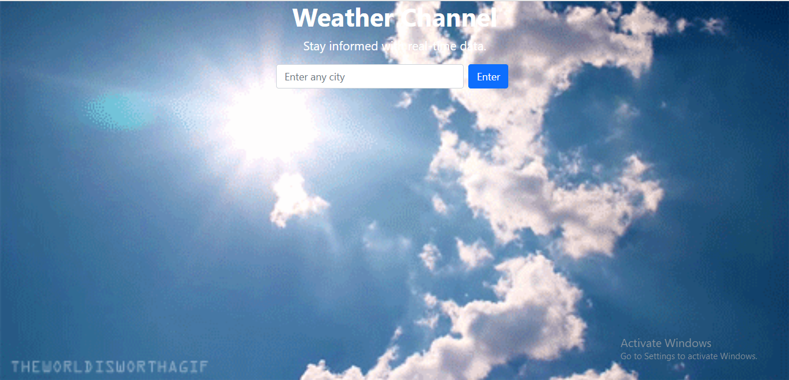

# weather
 This project comes after the introduction of the ES6 class keyword, ES6 modules, and webpack. The main goal of this project is for the student to show the understanding of the benefits of modularized code as well as the ability to set up a javascript application made of different modules using webpack.

 ## Screen shot of Page

 ## Page live Demo Link

 [Live Demo Link!](https://pensive-brattain-aa1034.netlify.app/)

 ## Built With

- Javascript.
- HTML.
- CSS

 ## How It work 
  - Frist Open Your terminal and paste : git clone git@github com:ccobasi/weather.git.

  - Then cd to the Folder && Open it in your Texteditor.

  - To Make the website fully working make sure to install the webpack
    and run the folowing command if yoy don't have it.
  - type npm start to start the server.
  - now you can see the page.

  ## Author
  👤 **Chukwuma Obasi**

  - Github (@ccobasi)  [chukwuma obasi](www.github.com/ccobasi)
  - twitter (@obasichux)  [chukwuma](www.twitter.com/obasichux)
  - linkedIn [chukwuma-obasi](https://www.linkedin.com/in/chukwuma-obasi/)

 ## Feedback

 - Give A  thumb-up 👍 if you like it.

 ## License 

 - This project is MIT license